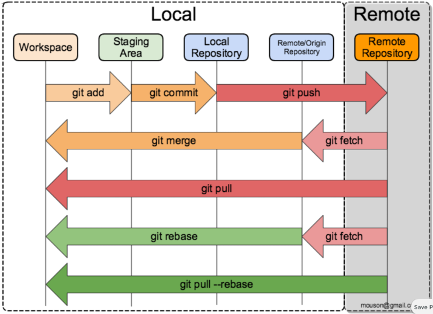

# Git | GitHub



```shell
git config --global user.name "Daniel Bakel"
git config --global user.email "bakeld85@gmail.com"
```

`1st option`

```shell
git clone git@github.com:BakelD/bakeld_dev.git
git status
git add .                   |  ↓ git rm --cached file_name
git commit -m "..."
    (git commit --amend -m "...")  // change last commit
git push
```

`2nd option`

```shell
git init
git status
git add .
git commit -m "..."
get remote add origin git@github.com:BakelD/bakeld_dev.git
(git remote -v)
git push -u origin master
```

`logging`

```shell
git log  |  git log --pretty=oneline  |  git log --graph --oneline
```

`checkout`

```shell
git checkout commit_hash
git checkout branch_name
```

`HEAD (pointer)`

```shell
HEAD
   ↓
branch_name
   ↓
last commit
```

# Branches

```shell
git checkout -b branch_name

or

git branch branch_name
git checkout branch_name
```

```shell
git branch          // list of branches
git branch -a       // list of branches (local and remote)
```

```shell
git branch -m new_branch_name
git branch -d branch_name       // delete NOT current branch
```

`merge`

```shell
git merge branch_name    // HEAD --> receiving branch (f.e main)
         (feature branch)
```

# SSH key

```shell
1) generate SSH key
   ssh-keygen -t ed25519 -C "bakeld85@gmail.com"

2) add SSH key to clipboard
   clip < ~/.ssh/id_ed25519.pub // (Windows)
 pbcopy < ~/.ssh/id_ed25519.pub // (Mac)

3) GitHub -> settings -> SSH and GPG keys -> New SSH keys ... paste
```
